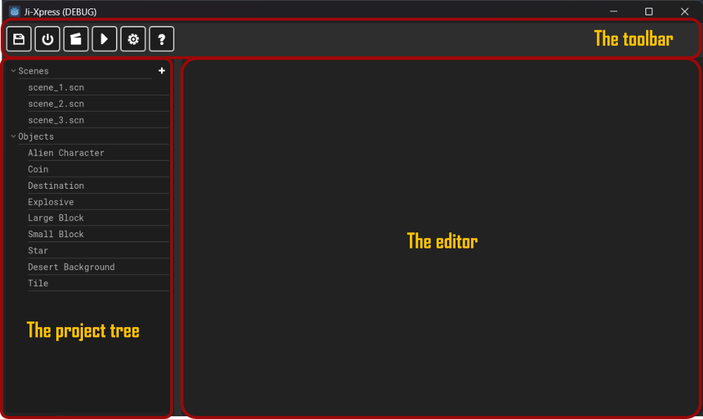

# Ji-Xpress Documentation
Welcome to the Ji-Xpress documentation. Ji-Xpress is a fun and engaging platform for Story Tellers to tell their stories in the form of fun and engaging games. The tool is developed to with intuitive visual experiences that will make telling these engaging stories dead simple.

## Product Features

* Visual WYSIWYG editor for Story Scenes.
* Visual Code Editor for various Game objects.
* Ability to work accross multiple Scenes.
* Ability to manage different projects each with different customizations.

## The Ji-Xpress interface

The interface is composed of the following major elements:

* The toolbar: Presenting shortcuts to all the major functionality.
* The project tree: Contains scenes as well as references to Game Objects.
* The editor: Edits both the story canvas as well as custom visual code.

## Toolbar buttons

* **Save Story**: Saves all unsaved tabs.
* **Quit Story**: Quits the current project and reverts back to the launcher.
* **Run Scene**: Runs the current scene that is being edited.
* **Run Project**: Runs the project's default start scene. **Note:** This needs to be defined in the project settings.
* **Project Settings**: Presents the project settings dialog.
* **Help**: Opens up the product documentation.

## Project tree

The project tree is composed of 2 sections:

* **Scenes section**: which is used to manage the story scenes. Pressing the plus button ("+") next to the scenes creates a new scene. Double clicking on a scene opens up the scene for editing. More on [Scene Editing](scene_editing.md)
* **Objects section**: Presents the objects available in the current story pack (more on story packs abit later). Double clicking on each object presents the code editor for that object. More on [Code Editing](code_editing.md)

## Story Packs

Ji-Xpress works on the concept of Story Packs. Each pack has unique objects that behave in different ways, and can be customized differently. In future versions of the product, we intend to have the product have user contributed story packs. For now though, we shall develop these packs internally as part of the Ji-Xpress product itself.

The following are the current packs that are in built into Ji-Xpress:

* The `platformer` pack. More on the [Platformer Pack here](packs/platformer.md).
* The `physics` pack. More on the [Physics Pack here](packs/physics.md).