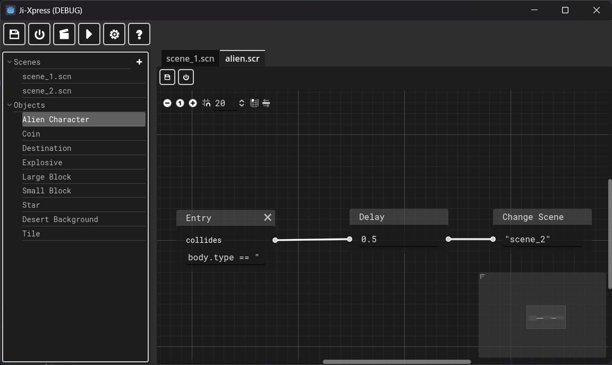
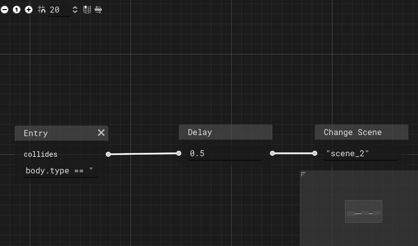
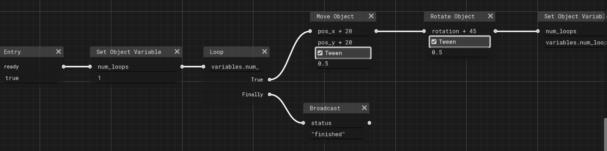

# Code Editing

Code editing involves selecting an object (from the scene tree) and editing it on the main editor. Normally the editor looks like so when editing code:

Ji-Xpress makes use of a visual code editing experience.

## Elements of the code editor canvas

It consists of a toolbar and the visual code editor.

### Toolbar elements

* **Save canvas:**: Saves the current code canvas.
* **Save and close**: Saves the code canvas and closes the tab.

Operating the canvas:

* **Middle mouse click and drag**: Allows scrolling for the canvas.
* **Right Click**: Presents the context menu.
* **Delete**: Pressing `Delete` keyboard button will delete the current selected / active object.
* **Escape**: Pressing `Esc` key deselects any selected object.

### Context menu elements

Various context menu elements allow you to add different types of code blocks (to be explained later).

## Code Blocks

Code Blocks allow execution of logic visually. They allow you to customize the customizable habits of each object.

Ji-Xpress executes code from what is known as **Entry Blocks**. Entry Blocks signify entry points when various events take place. **These entry points will be different in between Story packs.**

Each object will also have a custom set of functions which will define **Custom Function Blocks**.

For entry points and custom functions, refer to the Story Pack documentation. Below however are code blocks that are common in all objects:

Note: Some blocks also has a `finally` port. This port code to execute in normal sequence after the routine branching of logic execution is complete. At the moment these ports are available in the `loop` and `condition` blocks.

* `Add Break` - Breaks up a loop's execution.
* `Add Broadcast` - Allows you to broadcast a message to all objects present in the scene. The message can be constructed using expressions (more on expressions below).
* `Add Condition` - Allows branching of logic based on meeting specific conditions - evaluated by expressions (more on expressions below).
* `Add Loop` - Allows repetition of blocks of code that meet a specific conditions - evaluated by expressions (more on expressions below).
* `Add Move Object` - Moves the object. It also allows the movement to be a tween (if the tween checkbox is checked). The X and Y axis parameters, as well as the Tween duration, can be computed using expressions (more on expressions below).
* `Add Rotate Object` - Rotates the object in degrees. It also allows the rotation to be a tween (if the tween checkbox is checked). The angular rotation parameter, as well as the Tween duration, can be computed using expressions (more on expressions below).
* `Add Set Object Variable` / `Add Set Global Variable` / `Add Set Object Property` - Allows setting object / global variables as well as object properties. These variables and properties can be custom across different Story Packs and also across different Objects in the Pack. Global variables are however shared across different objects as well as different Story Scenes. The value of the variable or property can be computed using expressions (more on expressions below).
* `Add Delay` - Allows the delayed execution of the next block by a specified number of seconds (duration). The duration can also be computed using expressions (more on expressions below).
* `Add Change Scene` - Allows changing the current scene. The scene name can be computed using expressions (more on expressions below).

## Making use of expressions in code blocks

Expressions are formulas that can make use of existing values to compute a result. All expressions have access to:

Expression entries:

* `variables` - Object variables.
* `globals` - Global variables.
* `properties` - Object properties.
* `pos_x` - X axis position of the object.
* `pos_y` - Y axis position of the object.
* `rotation` - Rotation in degrees of the object.

Custom entries can also be made available by different game packs. For instance, a game pack may define custom entries for different types of entry points, such as when an object collides with another. Examples of some expressions:

* `pos_x + 20 + variables.pos_x_addition` - where `pos_x_addition` is an object variable. Adds 20 to `pos_x` and adds `pos_x_addition` variable.
* `rotation - globals.global_rotation_difference` - where `global_rotation_difference` is a global variable. Subtracts `global_rotation_difference` value from object's rotation.
* `properties.mass * 20` - adds 20 to the `mass` property of the current object.

### Making use of Variables and Properties

Some game packs may come with predefined global as well as object variables that are initialized as an object is created. Make reference to individual pack documentation for reference for this.

* To access a variable names `var_x` for the Object, you will define as so: `variables.var_x`
* To access a global variable names `var_x` for the Object, you will define as so: `globals.var_x`
* To access the `mass` property for the current object, you will define as so: `properties.mass`

## Example Code Blocks

### Example 1

When the object collides with a coin, delay for 0.5 seconds then change the scene to `scene_2`

Expressions:

* Collision Entry expression: `body.type == "coin"`
* Delay expression: `0.5`
* Change Scene expression: `"scene_2"` 

### Example 2

When the star object is loaded:

* Initialize number of loop variable to 1.
* Loop 5 times. For each loop:
    * Move the object `position_x` + 20, `position_y` + 20, Tween for 0.5 seconds
    * Rotate the object `rotation` + 45, `position_y` + 20, Tween for 0.5 seconds
    * Increment the loop counter
* Finally, broadcast to all other objects that the `status` is `"finished"`.

Expressions:

* Ready Entry expression: `true` - will always evaluate to true.
* Set Object Variable for `num_loops` - `1`
* Loop expression: `variables.num_loops <= 4`
* Move Object expression: `pos_x + 20` and `pos_y + 20` and tween expression: `0.5`
* Rotate Object expression: `rotation + 45` and tween expression: `0.5`
* Set Object Variable for `num_loops` at the end of this loop execution: `variables.num_loops + 1`
* Broadcast for `status` variable: `"finished"`