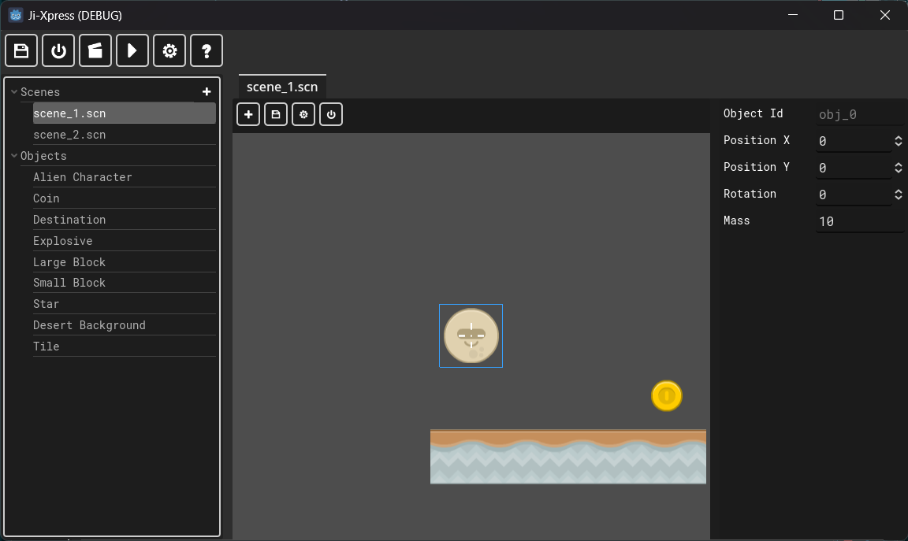

# Scene Editing

Scene editing involves selecting a scene (from the scene tree) and editing it on the main editor. Normally the editor looks like so when editing a scene:

## Elements of the scene editor

### Canvas

The left side presents the canvas with the toolbar buttons. The following are some of the toolbar buttons:

* **Add object**: Adds an object at the current scroll position.
* **Save canvas:**: Saves the current layout.
* **Canvas settings**: Allows adjusting snapping. You can place snapping settings for objects.
* **Save and close**: Saves the canvas and closes the tab.

Operating the canvas:

* **Middle mouse click and drag**: Allows scrolling for the canvas. You can also scroll the canvas with the `Ctrl` + `Left Click`.
* **Right Click**: Presents the context menu. You can select "Add Object Here" to add an object at the clicked position.
* **Delete**: Pressing `Delete` keyboard button will delete the current selected / active object.
* **Escape**: Pressing `Esc` key deselects any selected object.

### Properties

The right side of the editor presents properties of the current object. By default, the following properties are always present:

* `Object Id` - Unique ID of the selected object. This property is read only.
* `Position X` - X axis position.
* `Position Y` - Y axis position.
* `Rotation` - Rotation (in degrees) of the current object.